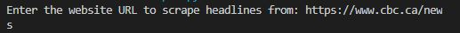
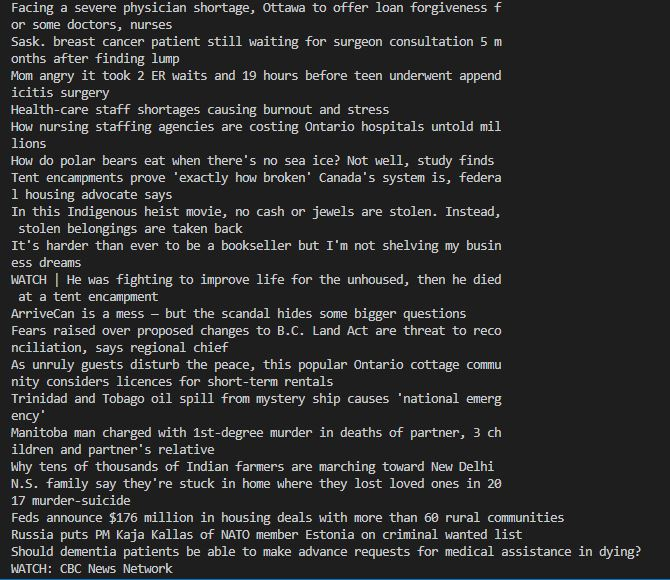

# Which package/library does the sample program demonstrate?
My sample program demonstrates beautifulsoup4 a python library designed for webscraping [[ref]](https://beautiful-soup-4.readthedocs.io/en/latest/)
# How does someone run your program? 
After installing Python and beautifulsoup4 a user simply runs the program and inputs the desired news website to be scraped.
# What purpose does your program serve?
My program scrapes inputted news websites and returns all headlines (h2 tags) 
# What would be some sample input/output?
Input:

Output:

