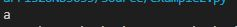
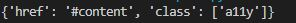

# Which package/library did you select?
BeautifulSoup4 a python package for webscraping (gathering information from HTML or XML files efficiently)[[ref]](https://beautiful-soup-4.readthedocs.io/en/latest/)

# How to use
## Installation
First install beautifulsoup4, I used pip via 
`pip install beautifulsoup4` [[ref]](https://beautiful-soup-4.readthedocs.io/en/latest/)

beautifulsoup4 requires a html parser, if you wish to use a parser other than the one included in Python's standard library you must install it [[ref]](https://beautiful-soup-4.readthedocs.io/en/latest/)

## Initializing the soup
First you must make a GET request to the website you wish to scrape, in this example url is a variable containing the string of the URL:
`response = requests.get(url)`[[ref]](https://requests.readthedocs.io/en/latest/)

using the response object, initialize the soup object like so:
`soup = BeautifulSoup(response.text, 'html.parser')` 
note: this method uses Pythons built in HTML parser [[ref]](https://beautiful-soup-4.readthedocs.io/en/latest/)
# Features and functionality
## Scraping
Now that you have a soup element you can invoke methods to pull relevent details from the HTMl file, for example in my sample program the line `headlines = soup.find_all('h3', class_='headline')` finds all the h3 tags with class = 'headline' and returns the text within, in this case news article headlines.  

## Tag element
You can access a tag element from a HTML document via:
`tag = soup.a` 
where a is the tag you want to access.

From here you can access different information about the tag such as:

`tag.name` which returns the name of the tag
Output:

`tag.attrs` which returns the attributes of the tag (if any)
Output:
[[ref]](https://beautiful-soup-4.readthedocs.io/en/latest/)

# When was beautifulsoup created?
Beautifulsoup3 was launched in May 2006
[[ref]](https://en.wikipedia.org/wiki/Beautiful_Soup_(HTML_parser))

# Why did I select this package

I am interested in building a larger application for stock price analysis and I felt that having experience with a web scraper would be beneficial for that project.  After doing some research beautifulsoup4 seemed like the best option

Learning about this package reinforced my idea that Python is a very readable and simple language, almost all of the functionality of beautifulsoup4 is fairly intuitive and simple which closely resembled learning Python itself.

# Overall Experience
My experience using this library was very pleasent, the documentation was easy to follow and understand and the package worked without much trouble, I would recommend this package to anyone looking to develope a webscraping application in Python.

I will continue to use this package, as explained earlier I will be using this package for stock price analysis
